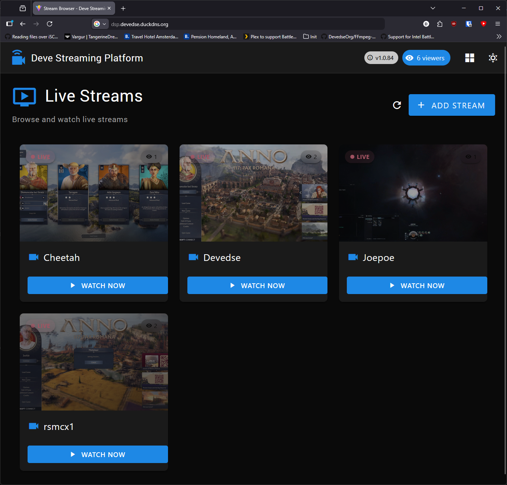
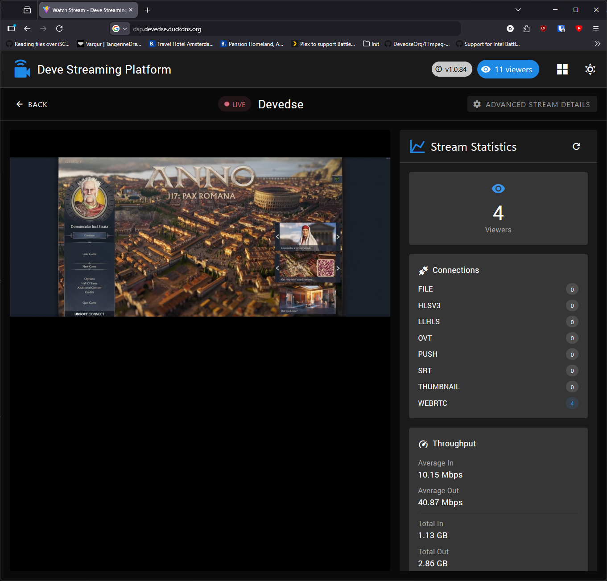
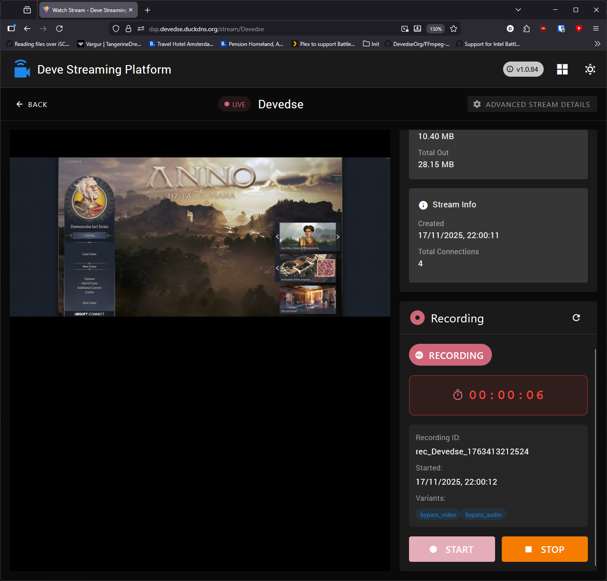
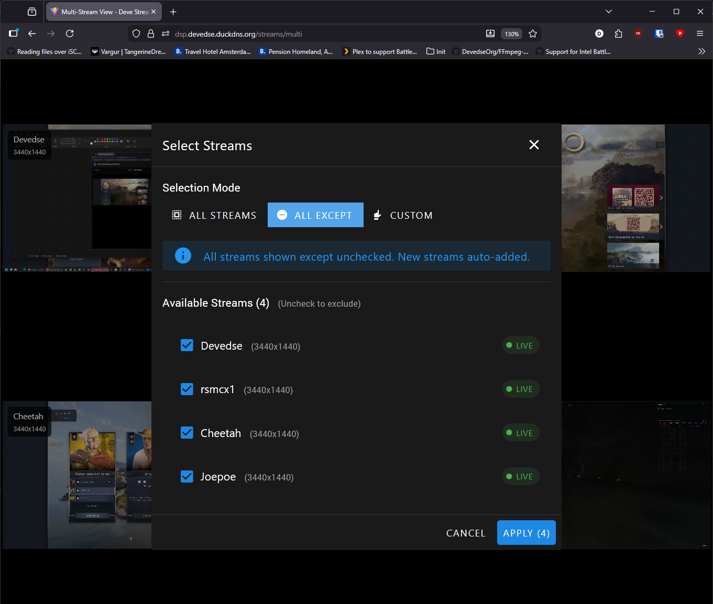

# Deve Streaming Platform

A modern web interface for managing and viewing live streams with OvenMediaEngine.



## Features

- 📺 Live Stream Management - View all active streams in real-time
- 🖼️ Stream Thumbnails - Automatic thumbnail generation from live streams
- 📊 Stream Statistics - Monitor bitrate, resolution, codec, and viewer count
- 🎬 Integrated Player - Built-in OvenPlayer for WebRTC playback
- 🌐 Multi-Protocol Support - Generate URLs for SRT, RTMP, WebRTC, and WHIP
- ⚡ Low Latency - WebRTC support for sub-second latency streaming

## Screenshots

### Stream Grid View
The main dashboard displaying all active streams with live thumbnails, stream information, and quick actions.


### Stream Details and Player
Individual stream view with integrated OvenPlayer showing live playback, detailed stream statistics including bitrate, resolution, codec information, and viewer count.



### Recording
It's also possible to start recording a stream.



### Multi-Stream View
Grid layout displaying multiple streams simultaneously, perfect for monitoring several streams at once with synchronized playback controls.



## Build Status

| GitHubActions Builds |
|:--------------------:|
| [](https://github.com/devedse/DeveStreamingPlatform/actions/workflows/githubactionsbuilds.yml) |

## Docker

| Docker Hub |
|:----------:|
| [](https://hub.docker.com/r/devedse/devestreamingplatform) |

## Usage

1. **Add a Stream**: Click the "+" button to generate streaming URLs
2. **Start Streaming**: Use the generated URLs in OBS or other streaming software

## Docker Deployment

Build and run with Docker Compose. The application uses nginx as a reverse proxy to communicate with OvenMediaEngine, so all API calls go through `/omeapi` internally.

Create a `docker-compose.yml`:

```yaml
services:
  ovenmediaengine:
    image: airensoft/ovenmediaengine:latest
    container_name: ovenmediaengine
    restart: unless-stopped

    # Environment variables - customize as needed
    environment:
      - OME_HOST_IP=*  # Change to your actual host IP if needed
      - OME_ORIGIN_PORT=9000
      - OME_RTMP_PROV_PORT=1935
      - OME_SRT_PROV_PORT=9999
      - OME_MPEGTS_PROV_PORT=4000
      - OME_LLHLS_STREAM_PORT=3333
      - OME_LLHLS_STREAM_TLS_PORT=3334
      - OME_WEBRTC_SIGNALLING_PORT=3333
      - OME_WEBRTC_SIGNALLING_TLS_PORT=3334
      - OME_WEBRTC_TCP_RELAY_PORT=3478
      - OME_WEBRTC_CANDIDATE_PORT=10000-10004
    ports:
      - "1935:1935"           # RTMP Provider
      - "9999:9999/udp"       # SRT Provider
      - "9000:9000"           # Origin Port
      - "3333:3333"           # LLHLS Stream / WebRTC Signalling
      - "3334:3334"           # LLHLS Stream TLS / WebRTC Signalling TLS
      - "3478:3478"           # WebRTC TCP Relay
      - "4000:4000/udp"       # MPEG-TS Provider
      #- "8081:8081"           # API Server (Doesn't need to be exposed as this goes through the internal docker network)
      #- "8082:8082"           # API Server TLS (Doesn't need to be exposed as this goes through the internal docker network)
      #- "20080:20080"         # Thumbnail Port (Doesn't need to be exposed as this goes through the internal docker network)
      #- "20081:20081"         # Thumbnail TLS Port (uncomment if using TLS)
      - "10000-10009:10000-10009/udp"  # WebRTC Candidate Ports
    volumes:
      - ./origin_conf:/opt/ovenmediaengine/bin/origin_conf
      - ./recordings:/recordings  # Change to your desired recording path
      - ./logs:/var/log/ovenmediaengine
      - ./letsencryptcerts:/etc/letsencrypt  # Optional: for TLS certificates
    #devices:
    #  - /dev/dri/renderD128:/dev/dri/renderD128  # Optional: for hardware acceleration

  # Let's Encrypt certificate management (In my case using duckdns, but you should use your own here
  # or just provie a certificate yourself)
  letsencrypt:
    image: maksimstojkovic/letsencrypt
    container_name: letsencrypt
    environment:
      - DUCKDNS_TOKEN=your-duckdns-token-here
      - DUCKDNS_DOMAIN=yourdomain.duckdns.org
      - LETSENCRYPT_EMAIL=your-email@example.com
      - UID=1000
      - GID=1000
    restart: unless-stopped
    volumes:
      - ./letsencryptcerts:/etc/letsencrypt

  devestreamingplatform:
    image: devedse/devestreamingplatform:latest
    container_name: devestreamingplatform
    restart: unless-stopped
    ports:
      - "8089:80"
    environment:
      # OvenMediaEngine Configuration (for nginx reverse proxy)
      - OME_API_URL=http://ovenmediaengine:8081
      - OME_API_TOKEN=ome-access-token

      # Thumbnail URL (for stream thumbnails)
      - OME_THUMBNAIL_URL=http://ovenmediaengine:20080

      # Provider URLs (for stream ingestion/pushing - displayed to streamers)
      # Use wss:// and https:// for TLS, ws:// and http:// for non-TLS
      - OME_PROVIDER_WEBRTC_URL=wss://yourdomain.example.com:3334
      - OME_PROVIDER_RTMP_URL=rtmp://yourdomain.example.com:1935
      - OME_PROVIDER_SRT_URL=srt://yourdomain.example.com:9999
      
      # Publisher URLs (for stream playback - used by players)
      - OME_PUBLISHER_WEBRTC_URL=wss://yourdomain.example.com:3334
      - OME_PUBLISHER_LLHLS_URL=https://yourdomain.example.com:3334

      # OME Server Configuration
      - OME_VHOST=default
      - OME_APP=app
      
      # Basic Authentication (optional)
      - BASIC_AUTH_USERNAME=admin
      - BASIC_AUTH_PASSWORD=secure-password
      
      # Stream Security (optional)
      - STREAM_AUTH_TOKEN=your-secure-token-here
```

**Complete Setup Notes:**
- Replace `yourdomain.example.com` with your actual domain or IP address
- The `letsencrypt` service is required to expose the WSS/HTTPS endpoints for the WebRTC/LLHLS streams
- Configure OvenMediaEngine with AdmissionWebhooks (see Security section below)
- Adjust volume paths according to your system setup

Then run:

```bash
docker-compose up -d
```

The application will be available at `http://localhost:8089`

### Available Environment Variables

| Variable | Description | Default |
|----------|-------------|---------|
| `OME_API_URL` | **Internal URL** for nginx to proxy to OvenMediaEngine API | Required |
| `OME_API_TOKEN` | OME API access token (used by proxy, not exposed to browser) | Required |
| **Provider URLs (Stream Ingestion)** | | |
| `OME_PROVIDER_WEBRTC_URL` | WebRTC provider URL for pushing streams (e.g., `ws://host:3333`) | Required |
| `OME_PROVIDER_RTMP_URL` | RTMP provider URL for pushing streams (e.g., `rtmp://host:1935`) | Required |
| `OME_PROVIDER_SRT_URL` | SRT provider URL for pushing streams (e.g., `srt://host:9999`) | Required |
| **Publisher URLs (Stream Playback)** | | |
| `OME_PUBLISHER_WEBRTC_URL` | WebRTC publisher URL for playback (e.g., `ws://host:3333`) | Required |
| `OME_PUBLISHER_LLHLS_URL` | LLHLS publisher URL for playback (e.g., `http://host:3333`) | Required |
| **Thumbnails** | | |
| `OME_THUMBNAIL_URL` | Thumbnail base URL (e.g., `http://host:20080`) | Optional |
| **Server Configuration** | | |
| `OME_VHOST` | Default virtual host | `default` |
| `OME_APP` | Default application name | `app` |
| **Authentication** | | |
| `BASIC_AUTH_USERNAME` | HTTP basic auth username (optional) | - |
| `BASIC_AUTH_PASSWORD` | HTTP basic auth password (optional) | - |
| `STREAM_AUTH_TOKEN` | Shared secret token used with OvenMediaEngine AdmissionWebhooks to prevent unauthorized stream access. Token is exposed to authenticated users but validates all stream connections. (See: "Stream Security") | Optional - uses "noauth" if not set |

### Architecture

OvenMediaEngine separates **Providers** (ingestion) from **Publishers** (playback):
- **Providers**: Accept incoming streams (RTMP, SRT, WebRTC push)
- **Publishers**: Deliver streams to viewers (WebRTC, LLHLS)

This separation allows you to:
- Use different ports for ingestion vs playback
- Expose only playback URLs publicly while keeping ingestion internal
- Scale providers and publishers independently

### How It Works

The application uses nginx as a reverse proxy with authentication:
- **Frontend → `/omeapi`** → nginx proxy (adds Basic Auth) → **OvenMediaEngine API** (`OME_API_URL`)
- **Frontend → `/thumbnails`** → nginx proxy → **OvenMediaEngine Thumbnails** (`OME_THUMBNAIL_URL`)
- This allows the frontend to make API calls and fetch thumbnails without CORS issues
- The `OME_API_URL`, `OME_API_TOKEN`, and `OME_THUMBNAIL_URL` are only used by nginx internally and never exposed to the browser
- All API requests from the browser go to `/omeapi` which nginx forwards to the actual OME server with authentication
- All thumbnail requests go to `/thumbnails` which nginx forwards to the OME thumbnail server
- The API token is injected by the proxy layer (nginx in production, Vite in development)

### Stream Security (AdmissionWebhooks)

The platform supports optional stream security using OvenMediaEngine's AdmissionWebhooks feature:

#### Configuration

Full reference OvenMediaEngine server configuration example used in this project can be found in `ovenmediaengine_example_Server.xml` (located at the repository root). You can open that file directly or copy it into your OME container's `origin_conf` directory as a starting point.

1. **Set Environment Variable**: Add `STREAM_AUTH_TOKEN` to your docker-compose.yml
2. **Configure OvenMediaEngine**: Add AdmissionWebhooks to your OME server configuration:

```xml
<AdmissionWebhooks>
    <ControlServerUrl>http://devestreamingplatform/webhook/admission</ControlServerUrl>
    <SecretKey>notused</SecretKey>
    <Timeout>3000</Timeout>
    <Enables>
        <!-- <Providers>rtmp,webrtc,srt</Providers> -->
        <Publishers>webrtc,llhls,thumbnail,srt</Publishers>
    </Enables>
</AdmissionWebhooks>
```

#### How Security Works

The platform implements a two-layer security model using Basic Authentication and stream tokens:

**Layer 1: Basic Authentication (Web Interface Access)**
- Users must authenticate with `BASIC_AUTH_USERNAME`/`BASIC_AUTH_PASSWORD` to access the web interface
- Only authenticated users can view stream URLs and tokens

**Layer 2: Stream Token Validation (Stream Access)**
- **Without `STREAM_AUTH_TOKEN`**: Streams use "noauth" mode - all connections are allowed
- **With `STREAM_AUTH_TOKEN`**: All stream/thumbnail URLs include the auth token (`?auth=your-token`)
- **AdmissionWebhooks Integration**: OvenMediaEngine calls the nginx webhook endpoint before allowing any stream connection
- **Token Verification**: The webhook validates that the auth token in the stream URL matches the configured `STREAM_AUTH_TOKEN`

## Local Development

### Installation

```bash
# Install dependencies
pnpm install

# Start development server  
pnpm dev
```

### Configuration

For local development, create a `.env.development` file. Vite is configured to proxy `/omeapi` requests to your OME server:

```env
# OvenMediaEngine server URL (used by Vite dev server proxy)
VITE_API_BASE_URL=http://your-ome-server:8081
VITE_API_ACCESS_TOKEN=your-access-token

# Thumbnail URL (for stream thumbnails)
VITE_THUMBNAIL_URL=http://your-ome-server:20080

# Provider URLs (for stream ingestion/pushing)
VITE_PROVIDER_WEBRTC_URL=ws://your-ome-server:3333
VITE_PROVIDER_RTMP_URL=rtmp://your-ome-server:1935
VITE_PROVIDER_SRT_URL=srt://your-ome-server:9999

# Publisher URLs (for stream playback)
VITE_PUBLISHER_WEBRTC_URL=ws://your-ome-server:3333
VITE_PUBLISHER_LLHLS_URL=http://your-ome-server:3333

# OME Configuration
VITE_OME_VHOST=default
VITE_OME_APP=app

# Stream Security (optional)
VITE_STREAM_AUTH_TOKEN=test123
```

The dev server will proxy API calls from `/omeapi` to `VITE_API_BASE_URL` and inject the authentication token. Thumbnail requests to `/thumbnails` are proxied to `VITE_THUMBNAIL_URL`.