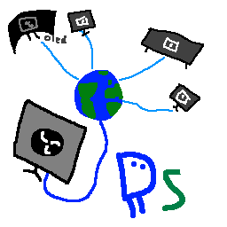
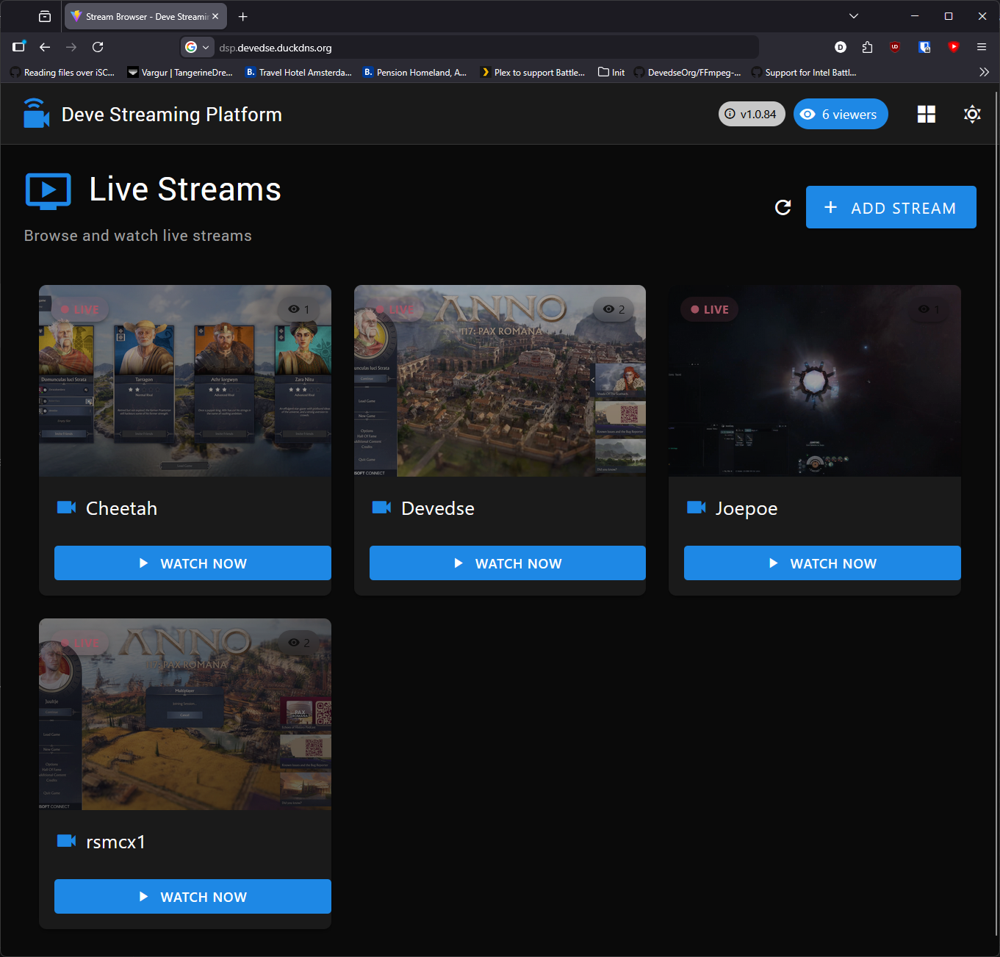
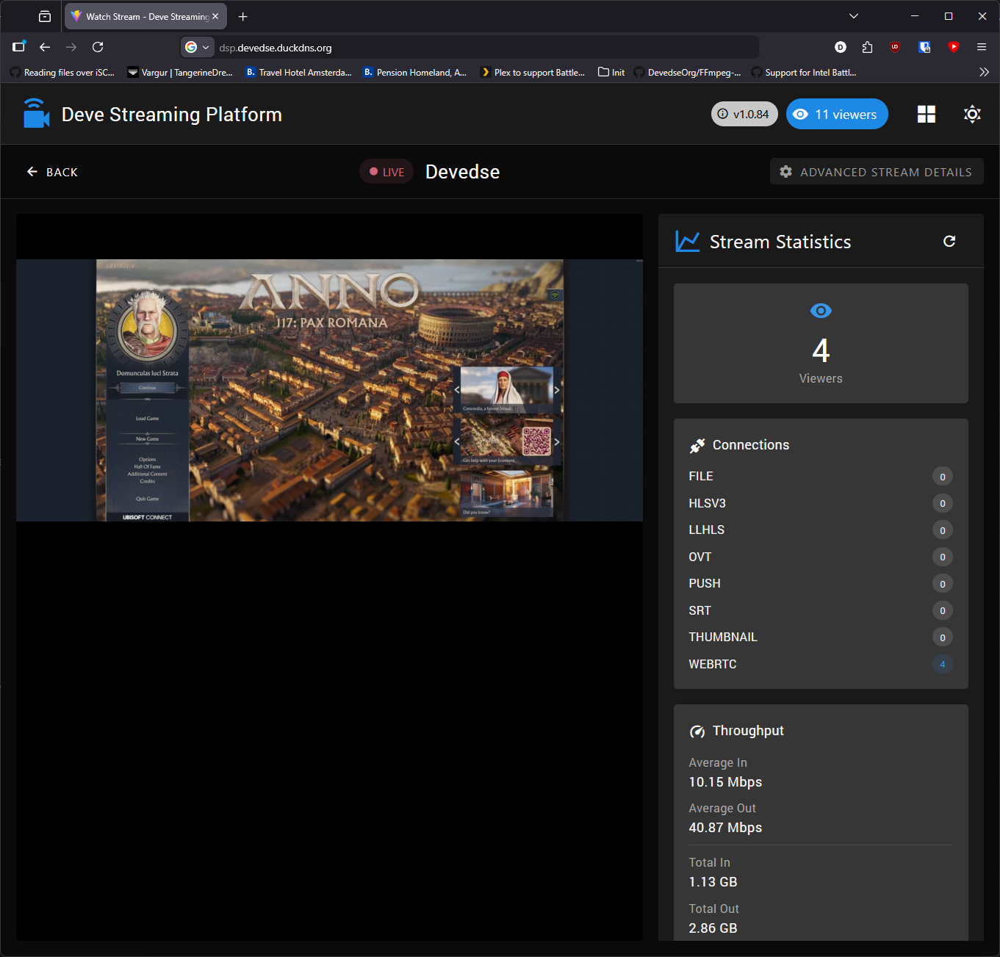
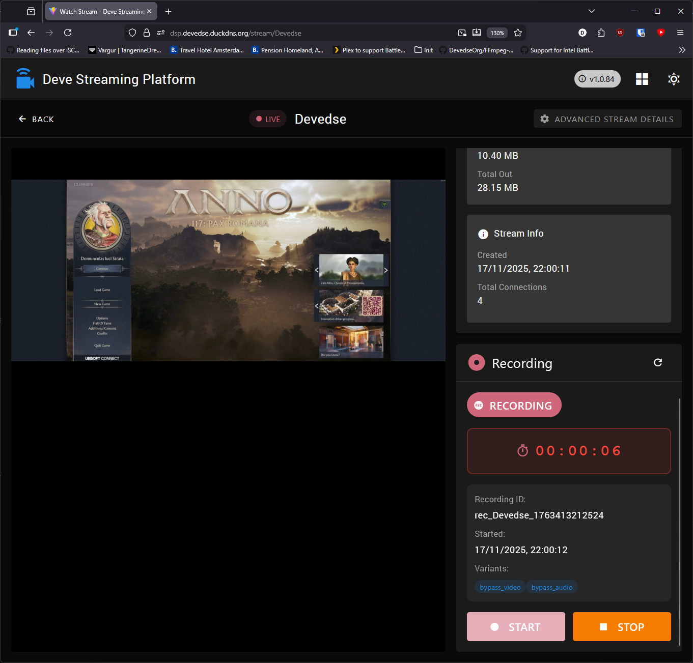
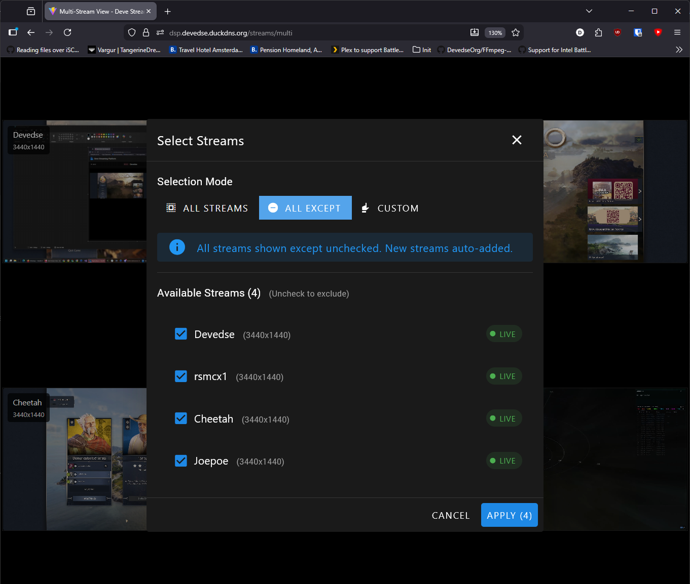

<p align="center">
  
</p>

# Deve Streaming Platform

[](https://discord.gg/3Jb72sRJ6T)

A simple streaming platform built on [OvenMediaEngine](https://github.com/AirenSoft/OvenMediaEngine), designed for sharing streams, desktops, and games with friends.

The idea is straightforward: you and your friends are a **trusted group** who all share a single admin password. Once logged in, everyone can manage streams — start recording, toggle visibility, create share links, etc. There's no complex user/role system; if you have the password, you're an admin.

### Stream Visibility

Streams fall into three categories:

| Category | Visible to | Description |
|----------|-----------|-------------|
| **Private** (default) | Admins only | Every new stream starts private. Only logged-in users can see or watch it. |
| **Public** | Everyone | Admins can publish a stream to the front page so anyone (even without logging in) can watch. |
| **Unlisted** | Anyone with the link | Admins can generate a secret share link. The stream won't appear anywhere publicly, but anyone with the link can watch. |

Non-authenticated visitors only see public streams. All management actions (recording, toggling visibility, pulling streams, etc.) require login.



## Features

- 📺 **Live Stream Management** — View and manage all active streams in real-time
- 🔒 **Private / Public / Unlisted Streams** — Control who can see each stream
- 🖼️ **Stream Thumbnails** — Automatic thumbnail generation from live streams
- 📊 **Stream Statistics** — Monitor bitrate, resolution, codec, and viewer count
- 🎬 **Integrated Player** — Built-in OvenPlayer for WebRTC playback
- 🌐 **Multi-Protocol Support** — Generate URLs for SRT, RTMP, WebRTC, and WHIP
- ⚡ **Low Latency** — WebRTC support for sub-second latency streaming
- 🔑 **Shared Admin Password** — Single password login with HttpOnly cookie auth

## Screenshots

### Stream Grid View
The main dashboard displaying all active streams with live thumbnails, stream information, and quick actions.


### Stream Details and Player
Individual stream view with integrated OvenPlayer showing live playback, detailed stream statistics including bitrate, resolution, codec information, and viewer count.



### Recording
Admins can start recording any stream directly from the UI.



### Multi-Stream View
Grid layout displaying multiple streams simultaneously, perfect for monitoring several streams at once with synchronized playback controls.



## Build Status

| GitHubActions Builds |
|:--------------------:|
| [](https://github.com/devedse/DeveStreamingPlatform/actions/workflows/githubactionsbuilds.yml) |

## Docker

| Docker Hub |
|:----------:|
| [](https://hub.docker.com/r/devedse/devestreamingplatform) |

## Usage

1. **Log in** with the shared admin password
2. **Add a Stream** — Click the "+" button to generate SRT/RTMP/WebRTC streaming URLs
3. **Start Streaming** — Use the generated URLs in OBS or other streaming software
4. **Manage Visibility** — Toggle streams to public or create unlisted share links as needed

## Docker Deployment

### Example Docker Compose

```yaml
services:
  ovenmediaengine:
    image: airensoft/ovenmediaengine:latest
    container_name: ovenmediaengine
    restart: unless-stopped
    environment:
      - OME_HOST_IP=*
      - OME_ORIGIN_PORT=9000
      - OME_RTMP_PROV_PORT=1935
      - OME_SRT_PROV_PORT=9999
      - OME_LLHLS_STREAM_PORT=3333
      - OME_WEBRTC_SIGNALLING_PORT=3333
      - OME_WEBRTC_SIGNALLING_TLS_PORT=3334
      - OME_WEBRTC_TCP_RELAY_PORT=3478
      - OME_WEBRTC_CANDIDATE_PORT=10000-10004
    ports:
      - "1935:1935"           # RTMP Provider
      - "9999:9999/udp"       # SRT Provider
      - "9000:9000"           # Origin Port
      - "3333:3333"           # LLHLS / WebRTC Signalling
      - "3334:3334"           # LLHLS TLS / WebRTC Signalling TLS
      - "3478:3478"           # WebRTC TCP Relay
      - "10000-10009:10000-10009/udp"  # WebRTC Candidate Ports
    volumes:
      - ./origin_conf:/opt/ovenmediaengine/bin/origin_conf
      - ./recordings:/recordings
      - ./letsencryptcerts:/etc/letsencrypt

  devestreamingplatform:
    image: devedse/devestreamingplatform:latest
    container_name: devestreamingplatform
    restart: unless-stopped
    ports:
      - "8089:80"
    environment:
      # Authentication
      - ADMIN_PASSWORD=your-secure-admin-password
      - STREAM_AUTH_TOKEN=your-secure-stream-token

      # OvenMediaEngine API (internal, proxied by nginx)
      - OME_API_URL=http://ovenmediaengine:8081
      - OME_API_TOKEN=ome-access-token
      - OME_THUMBNAIL_URL=http://ovenmediaengine:20080

      # OME Server Configuration
      - OME_VHOST=default
      - OME_APP=app
      - OME_APP_PUBLIC=public
      - OME_APP_UNLISTED=unlisted

      # Provider URLs (for stream ingestion - shown to streamers)
      - OME_PROVIDER_WEBRTC_URL=wss://yourdomain.example.com:3334
      - OME_PROVIDER_RTMP_URL=rtmp://yourdomain.example.com:1935
      - OME_PROVIDER_SRT_URL=srt://yourdomain.example.com:9999

      # Publisher URLs (for stream playback - used by players)
      - OME_PUBLISHER_WEBRTC_URL=wss://yourdomain.example.com:3334
      - OME_PUBLISHER_LLHLS_URL=https://yourdomain.example.com:3334

      # Cookie security (Secure flag is ON by default, disable only for plain HTTP)
      # - DISABLE_SECURE_COOKIES=true
```

### Environment Variables

| Variable | Description | Required |
|----------|-------------|----------|
| **Authentication** | | |
| `ADMIN_PASSWORD` | Admin login password | Yes |
| `STREAM_AUTH_TOKEN` | Token for OvenMediaEngine AdmissionWebhook stream validation | Yes |
| `DISABLE_SECURE_COOKIES` | Set `true` to remove `Secure` flag from cookies (for plain HTTP only) | No |
| **OvenMediaEngine API** | | |
| `OME_API_URL` | Internal OME API URL (proxied by nginx, never exposed to browser) | Yes |
| `OME_API_TOKEN` | OME API access token (injected by nginx proxy) | Yes |
| `OME_THUMBNAIL_URL` | OME thumbnail server URL | Yes |
| **OME Server Config** | | |
| `OME_VHOST` | OME virtual host name | Yes |
| `OME_APP` | OME application name (main/private streams) | Yes |
| `OME_APP_PUBLIC` | OME application name for public streams | Yes |
| `OME_APP_UNLISTED` | OME application name for unlisted (secret-link) streams | Yes |
| **Provider URLs (Ingestion)** | | |
| `OME_PROVIDER_WEBRTC_URL` | WebRTC push URL (e.g., `wss://host:3334`) | Yes |
| `OME_PROVIDER_RTMP_URL` | RTMP URL (e.g., `rtmp://host:1935`) | Yes |
| `OME_PROVIDER_SRT_URL` | SRT URL (e.g., `srt://host:9999`) | Yes |
| **Publisher URLs (Playback)** | | |
| `OME_PUBLISHER_WEBRTC_URL` | WebRTC playback URL (e.g., `wss://host:3334`) | Yes |
| `OME_PUBLISHER_LLHLS_URL` | LLHLS playback URL (e.g., `https://host:3334`) | Yes |

### How Stream Visibility Works

All streams land in the **private app** (`OME_APP`) by default. Admins can then:

- **Make a stream public** — creates a MultiplexChannel in the **public app** (`OME_APP_PUBLIC`) using OME's `stream://` protocol for zero-copy internal relay. The stream appears on the front page for everyone.
- **Create an unlisted share link** — creates a MultiplexChannel in the **unlisted app** (`OME_APP_UNLISTED`) with a random secret in the channel name. Anyone with the link can watch, but the stream won't appear anywhere publicly.

> **Important:** `OME_APP_UNLISTED` must be a **different** OME application than `OME_APP_PUBLIC`. If both point to the same app, unlisted streams will appear as public streams.

Both the public and unlisted apps need OVT and Multiplex providers enabled in your OME `Server.xml`. **Each app must use a separate `<MuxFilesDir>`** to prevent OME's Multiplex provider from broadcasting channels across apps:

```xml
<!-- In the public app -->
<Multiplex>
    <MuxFilesDir>mux_files/public</MuxFilesDir>
</Multiplex>

<!-- In the unlisted app -->
<Multiplex>
    <MuxFilesDir>mux_files/unlisted</MuxFilesDir>
</Multiplex>
```

You must also create these directories inside your OME `origin_conf` folder:

```bash
mkdir -p origin_conf/mux_files/public origin_conf/mux_files/unlisted
```

See `ovenmediaengine_example_Server.xml` for a complete working example.

### AdmissionWebhooks (Stream Security)

Configure OvenMediaEngine to validate stream connections via the platform's webhook:

```xml
<AdmissionWebhooks>
    <ControlServerUrl>http://devestreamingplatform/webhook/admission</ControlServerUrl>
    <SecretKey>notused</SecretKey>
    <Timeout>3000</Timeout>
    <Enables>
        <Publishers>webrtc,llhls,thumbnail,srt</Publishers>
    </Enables>
</AdmissionWebhooks>
```

The webhook auto-allows streams in the public and unlisted apps, and requires `?auth=<STREAM_AUTH_TOKEN>` for private app streams.

## Local Development

```bash
pnpm install
pnpm dev
```

Create a `.env.development` file:

```env
VITE_API_BASE_URL=http://your-ome-server:8081
VITE_API_ACCESS_TOKEN=your-access-token
VITE_THUMBNAIL_URL=http://your-ome-server:20080

VITE_PROVIDER_WEBRTC_URL=ws://your-ome-server:3333
VITE_PROVIDER_RTMP_URL=rtmp://your-ome-server:1935
VITE_PROVIDER_SRT_URL=srt://your-ome-server:9999

VITE_PUBLISHER_WEBRTC_URL=ws://your-ome-server:3333
VITE_PUBLISHER_LLHLS_URL=http://your-ome-server:3333

VITE_OME_VHOST=default
VITE_OME_APP=app
VITE_OME_APP_PUBLIC=public
VITE_OME_APP_UNLISTED=unlisted

VITE_ADMIN_PASSWORD=admin
VITE_STREAM_AUTH_TOKEN=test123
```

The dev server proxies `/omeapi`, `/public-api`, `/thumbnails`, and `/public-thumbnails` to your OME server, and provides mock auth endpoints matching the production nginx behavior.