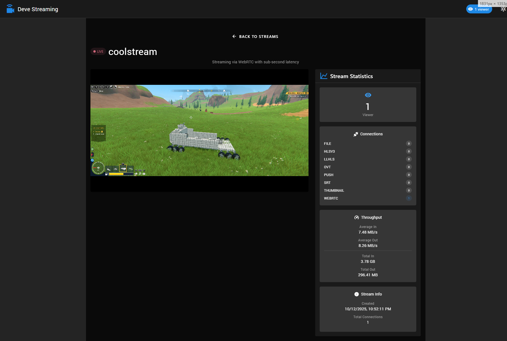

# Deve Streaming Platform

A modern web interface for managing and viewing live streams with OvenMediaEngine.



## Features

- 📺 **Live Stream Management** - View all active streams in real-time
- 📊 **Stream Statistics** - Monitor bitrate, resolution, codec, and viewer count
- 🎬 **Integrated Player** - Built-in OvenPlayer for WebRTC playback
- 🌐 **Multi-Protocol Support** - Generate URLs for SRT, RTMP, WebRTC, and WHIP
- ⚡ **Low Latency** - WebRTC support for sub-second latency streaming

## Build Status

| GitHubActions Builds |
|:--------------------:|
| [](https://github.com/devedse/DeveStreamingPlatform/actions/workflows/githubactionsbuilds.yml) |

## Docker

| Docker Hub |
|:----------:|
| [](https://hub.docker.com/r/devedse/devestreamingplatform) |

## Usage

1. **Add a Stream**: Click the "+" button to generate streaming URLs
2. **Start Streaming**: Use the generated URLs in OBS or other streaming software
3. **View Stream**: Streams appear automatically on the home page
4. **Monitor Stats**: Click any stream to view detailed statistics

### Streaming URL Examples

- **RTMP**: `rtmp://server:1935/app/` + stream key
- **SRT**: `srt://server:9999?streamid=app/app/streamname`
- **WebRTC Ingest**: `ws://server:3333/app/streamname?direction=send`
- **WHIP**: `http://server:3333/app/streamname?direction=whip`

## Docker Deployment

Build and run with Docker Compose. Configuration is injected at runtime via environment variables.

Create a `docker-compose.yml`:

```yaml
services:
  devestreaming:
    image: devedse/devestreamingplatform:latest
    container_name: devestreaming
    restart: unless-stopped
    ports:
      - "8089:80"
    environment:
      # OvenMediaEngine Configuration
      - OME_API_URL=http://10.88.28.212:8081
      - OME_API_TOKEN=ome-access-token
      - OME_WEBRTC_URL=ws://10.88.28.212:3333
      - OME_RTMP_URL=rtmp://10.88.28.212:1935
      - OME_SRT_URL=srt://10.88.28.212:9999
      - OME_VHOST=default
      - OME_APP=app
      # Basic Authentication
      - BASIC_AUTH_USERNAME=admin
      - BASIC_AUTH_PASSWORD=secure-password
```

Then run:

```bash
docker-compose up -d
```

The application will be available at `http://localhost:8089`

### Available Environment Variables

| Variable | Description | Default |
|----------|-------------|---------|
| `OME_API_URL` | OvenMediaEngine API URL | `http://10.88.28.212:8081` |
| `OME_API_TOKEN` | OME API access token | `ome-access-token` |
| `OME_WEBRTC_URL` | WebRTC signaling URL | `ws://10.88.28.212:3333` |
| `OME_RTMP_URL` | RTMP server URL | `rtmp://10.88.28.212:1935` |
| `OME_SRT_URL` | SRT server URL | `srt://10.88.28.212:9999` |
| `OME_VHOST` | Default virtual host | `default` |
| `OME_APP` | Default application name | `app` |
| `BASIC_AUTH_USERNAME` | HTTP basic auth username | `admin` |
| `BASIC_AUTH_PASSWORD` | HTTP basic auth password | `changeme` |

## Local Development

### Installation

```bash
# Install dependencies
pnpm install

# Start development server
pnpm run dev
```

### Configuration

For local development, edit `.env.development` to configure your OvenMediaEngine connection:

```env
VITE_API_BASE_URL=http://your-ome-server:8081
VITE_API_ACCESS_TOKEN=your-access-token
VITE_WEBRTC_URL=ws://your-ome-server:3333
VITE_RTMP_URL=rtmp://your-ome-server:1935
VITE_SRT_URL=srt://your-ome-server:9999
VITE_OME_VHOST=default
VITE_OME_APP=app
```